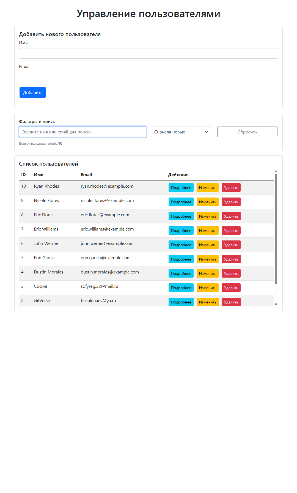

# 👥 UserManager — CRUD-приложение для управления пользователями

[](https://www.python.org/downloads/)
[](https://flask.palletsprojects.com/)
[](https://www.docker.com/)
[](https://github.com/bsekinaev/UserManager/actions)
[](https://codecov.io/gh/bsekinaev/UserManager)

> 📋 **Контекст:** Данное решение выполнено для отбора на стажировку по задаче для **Fullstack-разработчиков от Digital агентства «Победа»** (программа «Нетология.Лаборатория практики»).  
> Проект демонстрирует полный цикл разработки: от проектирования REST API и валидации данных до контейнеризации, автоматического тестирования и CI/CD.

## ✨ Функциональность

### ✅ Выполнено согласно заданию
- REST API на Flask: `GET /users`, `GET /users/<id>`
- Хранение данных в SQLite
- Базовая обработка ошибок (404, 500)
- Frontend на Vanilla JS + Bootstrap 5: отображение таблицы, модальное окно с деталями

### 🚀 Реализовано сверх требований
- Полный CRUD (Create, Read, Update, Delete) с подтверждением удаления
- Поиск в реальном времени по имени/email + сортировка (по дате, алфавиту)
- Двухуровневая валидация (клиент + сервер) с подсветкой ошибок
- AJAX-обновления без перезагрузки страницы
- Защита от XSS и SQL-инъекций

### 🛠 Инфраструктура и качество кода
- 🐳 **Docker & Docker Compose**: готовое окружение для разработки и тестирования
- 🧪 **Pytest**: 10 изолированных тестов, покрытие ~98%
- 🔄 **GitHub Actions**: автозапуск тестов при каждом push/PR
- ⚙️ **Production-ready**: Gunicorn, healthcheck, запуск от непривилегированного пользователя
- 📝 **Расширенная документация** и примеры запуска

## 🛠 Технологический стек

| Категория | Технологии |
|-----------|------------|
| **Backend** | Python 3.9+, Flask 2.3.3, SQLite3, Gunicorn |
| **Frontend** | Vanilla JS (ES6+), Bootstrap 5, Fetch API, HTML5/CSS3 |
| **DevOps** | Docker, Docker Compose, GitHub Actions, pytest, coverage |
| **Безопасность** | Параметризованные SQL-запросы, экранирование HTML, валидация regex |

## 🚀 Быстрый старт

### 🐳 Через Docker (рекомендуется)
```bash
# Клонировать и запустить приложение
git clone https://github.com/bsekinaev/UserManager.git
cd UserManager
docker-compose up -d --build

# Приложение доступно: http://localhost:5000
```

### 💻 Локальная разработка (без Docker)
```bash
git clone https://github.com/bsekinaev/UserManager.git
cd UserManager

python -m venv venv
source venv/bin/activate   # Windows: venv\Scripts\activate

pip install -r requirements.txt
python app.py              # http://localhost:5000
```

## 🧪 Тестирование

Проект покрыт изолированными тестами с использованием временных БД. Запуск возможен как локально, так и в контейнере.

```bash
# Локально
python -m pytest tests/test_api.py -v --cov=app --cov=database --cov-report=term-missing

# В Docker
docker-compose --profile test up --build --exit-code-from test
```
*Статус покрытия отображается в бейдже репозитория. Конфигурация CI/CD автоматически запускает тесты при каждом push.*

## 📡 API Endpoints

| Метод | Endpoint | Описание | Коды ответа |
|-------|----------|----------|-------------|
| `GET` | `/users` | Список всех пользователей | `200`, `500` |
| `GET` | `/users/<id>` | Данные пользователя по ID | `200`, `404`, `500` |
| `POST` | `/users` | Создание нового пользователя | `201`, `400`, `409`, `500` |
| `PUT` | `/users/<id>` | Обновление данных | `200`, `400`, `404`, `409`, `500` |
| `DELETE` | `/users/<id>` | Удаление пользователя | `200`, `404`, `500` |

## 🔒 Безопасность и лучшие практики
- ✅ **SQL-инъекции**: используются параметризованные запросы (`?`)
- ✅ **XSS**: все данные экранируются перед вставкой в DOM (`escapeHtml`)
- ✅ **Валидация**: строгие regex для email и имени на сервере и клиенте
- ✅ **Docker**: приложение запускается от пользователя `appuser` (не root)
- ✅ **Healthcheck**: Docker отслеживает доступность API
- ✅ **Gunicorn**: production WSGI-сервер вместо встроенного Flask dev-server

## 📸 Скриншоты


## 👨‍💻 Автор
**Батраз Секинаев** | Python Backend Developer  
📍 Ставрополь, Россия | 🌍 Открыт к удалённой работе  
📱 Telegram: [@bsekinaev](https://t.me/bsekinaev) | ✉️ Email: bsekinaev@ya.ru  
💼 Портфолио: [github.com/bsekinaev](https://github.com/bsekinaev)
