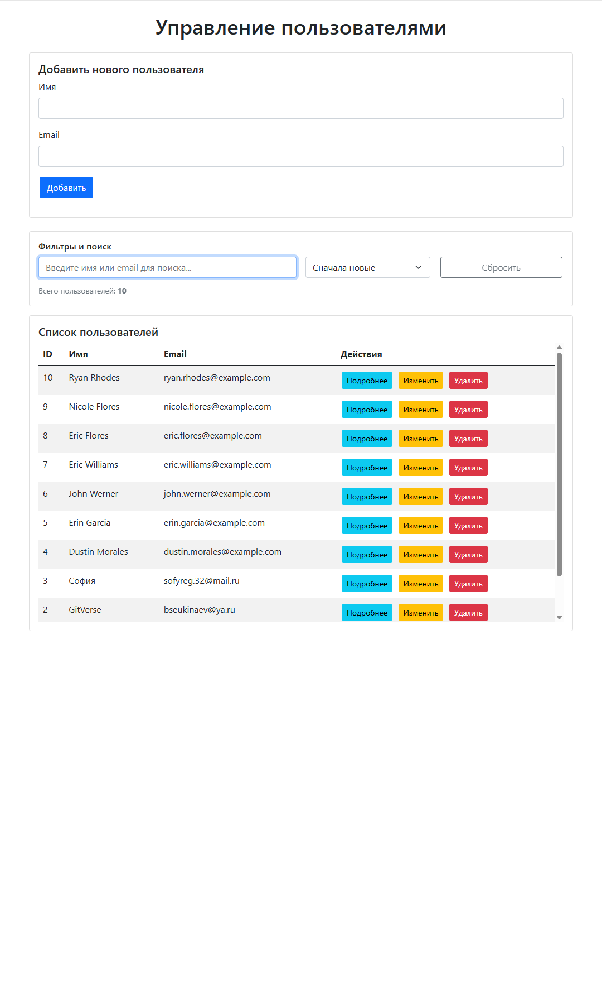

# 🚀 User Management System

<div align="center">


**Полнофункциональное веб-приложение для управления пользователями с современным UI/UX**

[Описание](#описание) • [Функциональность](#функциональность) • [Установка](#установка) • [Скриншоты](#скриншоты) • [API](#api-документация)

</div>

## 📖 Описание

Веб-приложение для управления пользователями с полнофункциональным CRUD интерфейсом, построенное на Flask и Vanilla JavaScript. Проект демонстрирует полный цикл разработки full-stack приложения.

**🔹 Реализовано сверх требований задания:**
- Расширенный CRUD (Create, Read, Update, Delete)
- Поиск и фильтрация в реальном времени
- Валидация данных на клиенте и сервере
- Современный UI с Bootstrap 5
- Обработка ошибок и уведомления

## 🎯 Функциональность

### Основные возможности
- ✅ **Просмотр пользователей** - таблица с списком всех пользователей
- ✅ **Добавление пользователей** - форма с валидацией
- ✅ **Редактирование пользователей** - модальное окно для изменений
- ✅ **Удаление пользователей** - с подтверждением операции
- ✅ **Детальный просмотр** - полная информация о пользователе

### Дополнительные функции
- 🔍 **Поиск в реальном времени** по имени и email
- 📊 **Сортировка** по разным критериям (имя, email, дата)
- 🎨 **Валидация форм** с подсветкой ошибок
- ⚡ **AJAX-обновления** без перезагрузки страницы
- 🛡️ **Защита от XSS** и SQL-инъекций

## 🛠 Технологии

### Backend
- **Python 3.9+** - язык программирования
- **Flask 2.3.3** - микрофреймворк
- **SQLite3** - база данных
- **RESTful API** - архитектура

### Frontend
- **Vanilla JavaScript (ES6+)** - без фреймворков
- **Bootstrap 5** - CSS-фреймворк
- **Fetch API** - HTTP-запросы
- **HTML5/CSS3** - семантическая верстка

## 🚀 Установка и запуск

### 1. Клонирование репозитория
```bash
git clone https://github.com/bsekinaev/UserManager.git
cd USERS
```
### 2. Создание виртуального окружения
```bash
# Linux/Mac
python -m venv venv
source venv/bin/activate

# Windows
python -m venv venv
venv\Scripts\activate
```
### 3. Установка зависимостей
```bash
pip install -r requirements.txt
```

### 4. Запуск приложения
```bash
python app.py
```
### 5. Открытие в браузере
```text
http://localhost:5000
```
### 6. Дополнительно можно заполнить базу тестовыми данными
```bash
python tests/test_app.py
```
